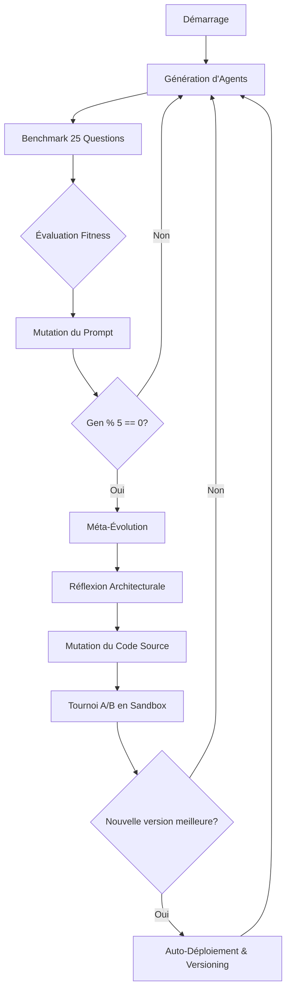

# Meta-MAS : Système Multi-Agents Auto-Évolutif

**Meta-MAS** est une architecture expérimentale de Système Multi-Agents (MAS) capable d'auto-conception et d'évolution autonome. Construit intégralement en Python natif, le système s'articule autour d'une double boucle darwinienne d'amélioration continue : celle des **prompts** (micro-évolution) et celle du **code source** (méta-évolution).

---

## 🚀 Vision et Concept

Dans un paradigme classique, les agents IA exécutent des tâches selon des prompts définis statiquement. **Meta-MAS** repense cette approche en dotant le système d'une **conscience d'orchestration**. 

Le système supervise une population de sous-agents qui tentent de résoudre des benchmarks complexes. À chaque itération, le Meta-MAS évalue les performances et fait évoluer soit les instructions (l'ADN de l'agent), soit son propre moteur interne pour lever les blocages structurels.

---

## 🧠 Comment ça marche ?

Le cœur de Meta-MAS repose sur un cycle itératif inspiré de la sélection naturelle.

### 1. La Micro-Évolution (Niveau Agent)
C'est l'optimisation continue des instructions de l'agent (**AgentDNA**).
- **Spawn** : Création d'une génération d'agents à partir de l'ADN le plus performant.
- **Exécution** : Les agents affrontent un benchmark logique de 25 questions (mathématiques, logique, géométrie).
- **Évaluation** : Le `LogicEnvironment` calcule un score de **Fitness** basé sur la justesse, le temps de réflexion et la consommation de tokens.
- **Mutation** : L'orchestrateur analyse les échecs et génère un nouvel ADN (Role Prompt) optimisé pour la génération suivante.

### 2. La Méta-Évolution (Niveau Système)
Toutes les 5 générations, le système effectue une introspection complète via son **Essaim d'Architectes**.
- **Réflexion** : Analyse des logs d'échecs récents et du code source actuel (dossier `core/`).
- **Proposition** : L'IA propose une modification algorithmique ciblée pour améliorer la robustesse (ex: gestion des timeouts, calcul de fitness, stratégies de retry).
- **Sandboxing** : La modification est appliquée dans un environnement isolé (`versions/v_next`).
- **Tournoi A/B** : Un test réel oppose la version actuelle à la nouvelle version.
- **Déploiement** : Si la nouvelle version surperforme l'ancienne, elle **remplace automatiquement** le code source du projet.



---

## 🛠 Architecture Modulaire

Le projet est structuré pour permettre une mutation fluide et sécurisée :

- **`core/` : Le cerveau du système**
  - `meta_mas.py` : L'Orchestrateur (gestion du budget, cycles d'évolution micro).
  - `agent.py` : Définition des agents et leur logique d'exécution.
  - `self_improvement.py` : Gestionnaire de méta-évolution, sandbox et tournois.
  - `environment.py` : Benchmark logique et calculateur de fitness complexe.
  - `executor.py` : Moteur d'exécution asynchrone pour les tournois.
- **`versions/`** : Historique des mutations architecturales.
  - `reports/` : Rapports MD détaillant chaque gain de performance par version.
- **`models/dna.py`** : Structure de données de "l'ADN" (Prompts, Température).
- **`services/llm_client.py`** : Interface d'accès aux modèles (MiniMax-M2.5, etc.).

---

## 🏆 Innovations et Sécurité (v27+)

Le système intègre des protocoles de sécurité pour garantir la continuité de l'évolution :
- **Validation Syntaxique** : Avant tout déploiement, le code muté est compilé et testé (`compile()`) pour bannir les erreurs de syntaxe.
- **Validation Fonctionnelle** : Un "dry-run" vérifie que les classes et méthodes vitales sont toujours présentes après mutation.
- **Gestion du Budget** : Chaque évolution consomme du crédit virtuel, forçant le système à être efficace.
- **Anti-Régression** : Le tournoi A/B garantit qu'aucune mise à jour n'est déployée si elle dégrade les performances globales.

---

## 🚀 Lancement

```bash
# Installation des dépendances
pip install -r requirements.txt

# Lancement du cycle d'évolution autonome
python main.py
```

Le système s'arrête automatiquement si la Fitness cible (0.95) est atteinte, si le budget est épuisé ou après le nombre de générations défini dans `config/settings.json`.
